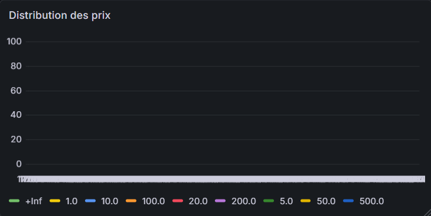
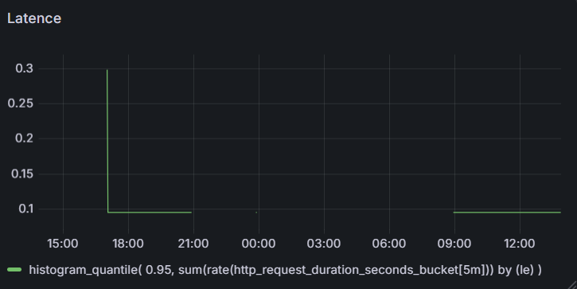
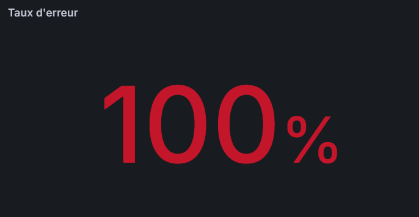
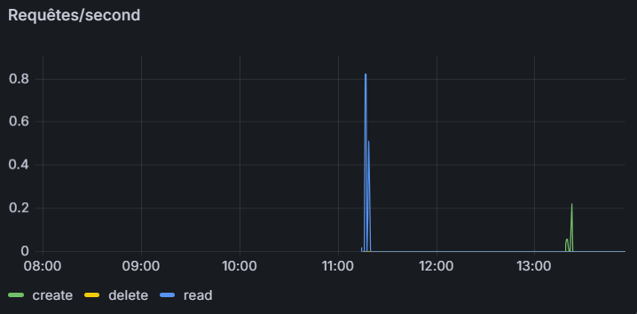
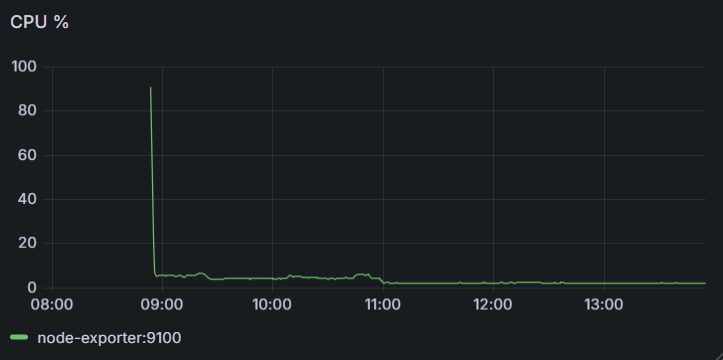
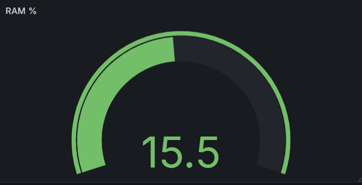
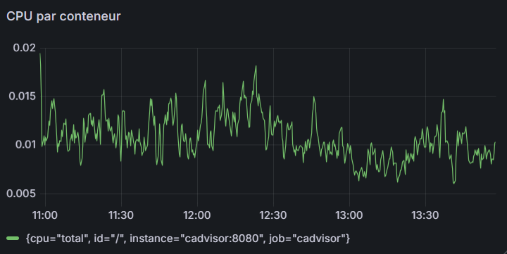
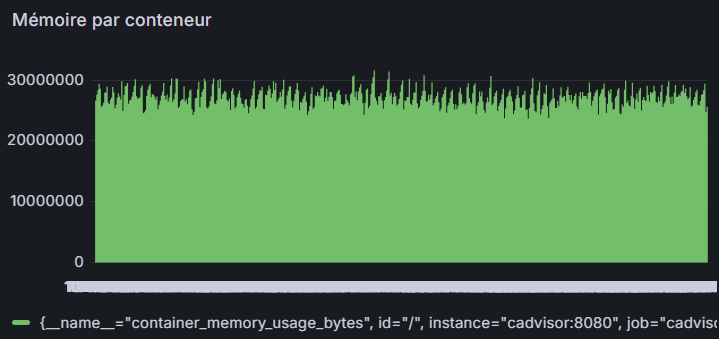
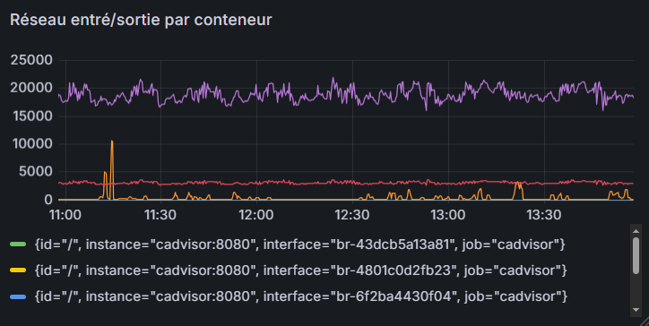

# Documentation & Justification des Choix

> **Projet :** Monitoring Full-Stack  
> **Outil :** Grafana + Prometheus

---

## Vue d'ensemble

Ce document décrit l'architecture des dashboards de monitoring, les choix de visualisation, les requêtes PromQL utilisées et leur justification technique. Le système de dashboards couvre 4 sections complémentaires pour une observabilité complète : business, applicative, infrastructure et conteneurs.

### Récapitulatif des contraintes respectées

| Contrainte                | Statut         | Détail                                          |
| ------------------------- | -------------- | ----------------------------------------------- |
| 6+ panels                 | ✅ 10 panels   | 2 + 3 + 2 + 3                                   |
| 3+ types de visualisation | ✅ 5 types     | Time Series, Bar Chart, Stat, Gauge, Table      |
| 1+ métrique custom        | ✅ 2 métriques | `item_price_distribution_bucket`, `items_total` |
| 1+ panel infrastructure   | ✅ 2 panels    | CPU % et RAM % via `node_exporter`              |

---

## Section 1 — Métriques Business

> **Objectif :** Donner une vue immédiate sur l'activité commerciale de l'application.

### Panel 1.1 — Distribution des Prix

| Attribut       | Valeur                                                  |
| -------------- | ------------------------------------------------------- |
| **Type**       | Bar Chart                                               |
| **Requête**    | `sum(rate(item_price_distribution_bucket[5m])) by (le)` |
| **Unité**      | `short` (occurrences/s)                                 |
| **Intervalle** | 5 minutes (rolling window)                              |

**Justification :**  
Le Bar Chart est le type le plus adapté pour représenter une distribution par tranches (`le` = _less or equal_, les buckets d'un histogramme Prometheus). Chaque barre correspond à un seuil de prix cumulatif. La fonction `rate()` sur 5 minutes lisse les variations brusques tout en restant réactif. L'agrégation `by (le)` décompose chaque bucket pour visualiser la forme de la distribution (queue longue, concentration, etc.).



> **Métrique custom :** `item_price_distribution_bucket` est une métrique applicative instrumentée manuellement dans le code métier, non fournie par les exporters standard.

---

### Panel 1.2 — Total d'Articles

| Attribut      | Valeur                                |
| ------------- | ------------------------------------- |
| **Type**      | Stat                                  |
| **Requête**   | `items_total`                         |
| **Unité**     | `short`                               |
| **Threshold** | Configurable selon objectifs business |

**Justification :**  
Le panel Stat affiche une valeur unique en grand format, idéal pour un KPI clé visible d'un coup d'œil. `items_total` est un compteur incrémental (type `counter` Prometheus) représentant le nombre total d'articles enregistrés dans le système. Pas de `rate()` ici car on veut le volume absolu, pas la vélocité.


> **Métrique custom :** `items_total` est exposée par l'application elle-même via le client Prometheus (instrumentation applicative).

---

## Section 2 — Requêtes HTTP

> **Objectif :** Surveiller la qualité de service perçue par les utilisateurs (latence, erreurs, débit).

### Panel 2.1 — Latence P95

| Attribut               | Valeur                                                                                  |
| ---------------------- | --------------------------------------------------------------------------------------- |
| **Type**               | Time Series                                                                             |
| **Requête**            | `histogram_quantile(0.95, sum(rate(http_request_duration_seconds_bucket[5m])) by (le))` |
| **Unité**              | `seconds`                                                                               |
| **Seuils recommandés** | Warning : 0.5s / Critical : 1s                                                          |

**Justification :**  
Le percentile 95 (P95) est l'indicateur de latence de référence pour les SLOs car il mesure l'expérience des utilisateurs les plus lents (95e centile) sans être biaisé par les outliers extrêmes comme le P99. La Time Series permet d'identifier les pics de latence dans le temps et de les corréler avec des déploiements ou des événements. La fenêtre de 5 minutes offre un bon compromis entre réactivité et stabilité du signal.



---

### Panel 2.2 — Taux d'Erreur

| Attribut               | Valeur                                                                            |
| ---------------------- | --------------------------------------------------------------------------------- |
| **Type**               | Stat                                                                              |
| **Requête**            | `(sum(rate(http_errors_total[5m])) / sum(rate(crud_operations_total[5m]))) * 100` |
| **Unité**              | `percent` (0–100)                                                                 |
| **Seuils recommandés** | Warning : 1% / Critical : 5%                                                      |

**Justification :**  
Un taux d'erreur exprimé en pourcentage est plus lisible qu'un compteur brut. Le panel Stat avec des couleurs de threshold (vert/orange/rouge) offre une alerte visuelle immédiate. Le ratio `http_errors_total / crud_operations_total` normalise les erreurs par rapport au volume de trafic, évitant les faux positifs en période de faible charge. La multiplication par 100 donne un pourcentage directement exploitable.



---

### Panel 2.3 — Requêtes par Seconde (RPS)

| Attribut    | Valeur                                                |
| ----------- | ----------------------------------------------------- |
| **Type**    | Time Series                                           |
| **Requête** | `sum(rate(crud_operations_total[1m])) by (operation)` |
| **Unité**   | `reqps`                                               |
| **Légende** | Par opération CRUD (create, read, update, delete)     |

**Justification :**  
La fenêtre de 1 minute (vs 5 min pour la latence) est délibérément plus courte pour être plus réactif aux pics de trafic soudains. La décomposition `by (operation)` permet d'identifier quelle opération génère le trafic (ex. : explosion des lectures lors d'un crawl, augmentation des créations lors d'une campagne). La Time Series avec plusieurs séries colorées est le format canonique pour ce cas d'usage.



---

## Section 3 — Infrastructure

> **Objectif :** Monitorer les ressources physiques/VM sous-jacentes via `node_exporter`.

### Panel 3.1 — CPU %

| Attribut               | Valeur                                                                          |
| ---------------------- | ------------------------------------------------------------------------------- |
| **Type**               | Time Series                                                                     |
| **Requête**            | `100 - (avg by(instance)(rate(node_cpu_seconds_total{mode="idle"}[2m])) * 100)` |
| **Unité**              | `percent` (0–100)                                                               |
| **Seuils recommandés** | Warning : 70% / Critical : 90%                                                  |

**Justification :**  
Le calcul `100 - idle%` est la méthode standard pour obtenir l'utilisation CPU depuis `node_exporter`. Soustraire le mode `idle` est plus fiable qu'additionner les autres modes (user, system, iowait…) car Prometheus peut avoir des modes supplémentaires selon les OS. La moyenne `by(instance)` permet un suivi multi-nœuds sur la même Time Series. La fenêtre de 2 minutes offre une détection rapide des pics CPU.



> **Panel Infrastructure :** Utilise les métriques `node_exporter` standards pour le monitoring système.

---

### Panel 3.2 — RAM %

| Attribut               | Valeur                                                                                             |
| ---------------------- | -------------------------------------------------------------------------------------------------- |
| **Type**               | Gauge                                                                                              |
| **Requête**            | `(node_memory_MemTotal_bytes - node_memory_MemAvailable_bytes) / node_memory_MemTotal_bytes * 100` |
| **Unité**              | `percent` (0–100)                                                                                  |
| **Seuils recommandés** | Warning : 80% / Critical : 95%                                                                     |

**Justification :**  
Le Gauge est préféré à la Time Series pour la RAM car c'est une ressource qui évolue lentement et dont on veut connaître l'état instantané, pas la tendance fine. L'utilisation de `MemAvailable` (plutôt que `MemFree`) est recommandée par le kernel Linux car elle inclut la mémoire récupérable depuis le cache, donnant une image plus juste de la mémoire réellement disponible pour de nouveaux processus.



> **Panel Infrastructure :** Complète le Panel 3.1 pour une couverture complète des ressources hôtes.

---

## Section 4 — Conteneurs

> **Objectif :** Observabilité fine des conteneurs Docker/Kubernetes via `cAdvisor`.

### Panel 4.1 — CPU par Conteneur

| Attribut    | Valeur                                        |
| ----------- | --------------------------------------------- |
| **Type**    | Time Series                                   |
| **Requête** | `rate(container_cpu_usage_seconds_total[1m])` |
| **Unité**   | `short` (CPU cores)                           |
| **Légende** | Par `container_name`                          |

**Justification :**  
La Time Series avec une série par conteneur permet de comparer visuellement la consommation CPU entre services. La fenêtre de 1 minute est volontairement courte pour détecter rapidement les conteneurs en runaway (boucle infinie, memory leak CPU). Les valeurs sont exprimées en cœurs CPU (ex. : 0.5 = 50% d'un cœur), ce qui facilite la comparaison avec les `limits` configurées dans Kubernetes/Docker.



---

### Panel 4.2 — Mémoire par Conteneur

| Attribut    | Valeur                          |
| ----------- | ------------------------------- |
| **Type**    | Bar Chart                       |
| **Requête** | `container_memory_usage_bytes`  |
| **Unité**   | `bytes` (auto-formaté en MB/GB) |
| **Légende** | Par `container_name`            |

**Justification :**  
Le Bar Chart est préféré à la Time Series pour la mémoire des conteneurs car on veut comparer le niveau absolu de consommation entre conteneurs à un instant T, et non leur évolution temporelle. Cette vue aide à identifier les conteneurs les plus gourmands en mémoire et à détecter des memory leaks (croissance monotone). La métrique `container_memory_usage_bytes` inclut le cache RSS+page cache, donnant la consommation totale.



---

### Panel 4.3 — Réseau Entrant/Sortant par Conteneur

| Attribut     | Valeur                                                                                                                                     |
| ------------ | ------------------------------------------------------------------------------------------------------------------------------------------ |
| **Type**     | Time Series                                                                                                                                |
| **Requêtes** | Receive : `rate(container_network_receive_bytes_total[1m])` / Transmit : `rate(container_network_transmit_bytes_total[1m])` _(recommandé)_ |
| **Unité**    | `bytes/s`                                                                                                                                  |
| **Légende**  | Par `container_name` + direction                                                                                                           |

**Justification :**  
La Time Series avec deux séries (receive/transmit) par conteneur visualise asymétries et pics de trafic réseau. Un pic soudain de `receive` peut indiquer un DDoS ou un batch import ; un pic de `transmit` peut révéler une exfiltration ou un service qui répond à trop de requêtes simultanées. La fenêtre de 1 minute maintient la réactivité nécessaire pour ce type d'événements.



---

## Synthèse des Choix de Visualisation

| Type            | Panels                  | Cas d'usage                            |
| --------------- | ----------------------- | -------------------------------------- |
| **Time Series** | 2.1, 2.3, 3.1, 4.1, 4.3 | Évolution temporelle, tendances, pics  |
| **Bar Chart**   | 1.1, 4.2                | Comparaison entre catégories/instances |
| **Stat**        | 1.2, 2.2                | KPI unique, alerte visuelle immédiate  |
| **Gauge**       | 3.2                     | Niveau instantané avec seuils visuels  |

---

## Recommandations d'Implémentation

### Variables de template (Grafana)

Ajouter des variables pour rendre les dashboards dynamiques :

- `$instance` → filtre sur `node_cpu_seconds_total{instance=~"$instance"}`
- `$container` → filtre sur `container_name=~"$container"`
- `$interval` → remplace les fenêtres hardcodées (`[5m]` → `[$interval]`)

### Alerting

Les panels suivants sont prioritaires pour configurer des alertes Grafana/Alertmanager :

1. **Taux d'erreur > 5%** (Panel 2.2) → PagerDuty / Slack `#incidents`
2. **CPU > 90%** (Panel 3.1) → Slack `#ops`
3. **RAM > 95%** (Panel 3.2) → PagerDuty
4. **Latence P95 > 1s** (Panel 2.1) → Slack `#performance`

### Organisation Grafana recommandée

```
📁 Monitoring
├── 📊 Métriques Business      ← Section 1
├── 📊 Requêtes HTTP           ← Section 2
├── 📊 Infrastructure          ← Section 3
└── 📊 Conteneurs              ← Section 4
```

Séparer en 2 dashboards distincts est recommandé :

- **App Dashboard** (Sections 1 + 2) → audience : développeurs, product
- **Infra Dashboard** (Sections 3 + 4) → audience : SRE, ops

---
